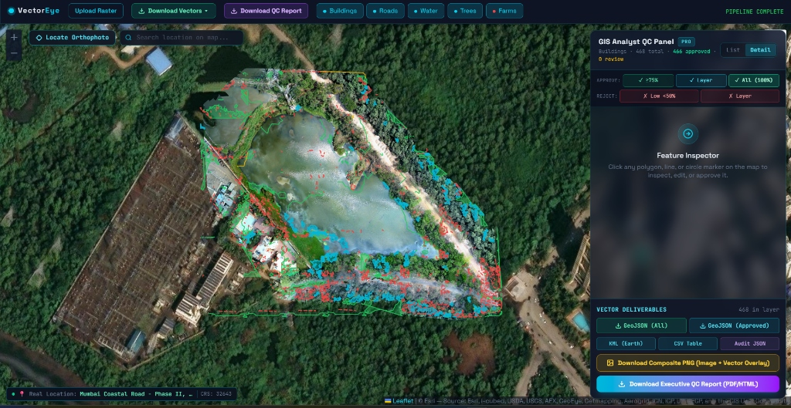

# VectorEye 🛰️👁️

> **AI-powered geospatial feature extraction and interactive Quality Control (QC) platform for aerial drone and satellite imagery.**

VectorEye ingests high-resolution orthophotos (GeoTIFFs), automatically detects geographic features using multi-model computer vision, converts raster predictions into georeferenced vector geometries (GeoJSON / PostGIS), and provides an interactive GIS Quality Control dashboard for human review, verification, and export.

---

## 📸 Output & QC Dashboard



---

## ✨ Key Features

- **Multi-Model AI Detection:**
  - 🏢 **Buildings**: Semantic rooftop footprint segmentation (YOLO)
  - 🛣️ **Roads & Infrastructure**: Transportation corridor extraction (YOLO)
  - 🌾 **Farms & Agriculture**: Field boundary segmentation (YOLO)
  - 🌲 **Trees & Forestry**: Tree crown and canopy detection (DeepForest)
  - 💧 **Water Bodies**: Visible Water Index (VWI) spectral color ratio analysis
- **Human-in-the-Loop QC Panel:**
  - Interactive Leaflet map overlay of orthophotos and detected vector layers.
  - Filter by confidence threshold, feature class, and approval status.
  - One-click approval, rejection, and polygon inspection.
- **GIS Export & Deliverables:**
  - Export clean, verified vectors as **GeoJSON** (ready for QGIS, ArcGIS).
  - Export **KML**, **CSV attribute tables**, and **Composite PNG overlays**.
  - Generate comprehensive **Executive QC Reports (HTML / PDF)**.

---

## 🔄 End-to-End Workflow

```
[GeoTIFF Orthophoto] 
        │
        ▼ (Upload)
┌─────────────────────────────────────────────────────────────┐
│ 1. INGESTION & TILING                                       │
│    • Extract spatial bounds, CRS, and location coordinates   │
│    • Slices high-resolution imagery into processing tiles   │
└─────────────────────────────────────────────────────────────┘
        │
        ▼
┌─────────────────────────────────────────────────────────────┐
│ 2. MULTI-MODEL AI INFERENCE                                 │
│    • FeatureRouter dispatches tiles to specialized models:  │
│      - YOLO (Buildings, Roads, Farms)                       │
│      - DeepForest (Trees)                                   │
│      - Spectral VWI (Water)                                 │
└─────────────────────────────────────────────────────────────┘
        │
        ▼
┌─────────────────────────────────────────────────────────────┐
│ 3. VECTORIZATION & STORAGE                                  │
│    • Converts pixel masks into smoothed vector polygons     │
│    • Reprojects coordinates to EPSG:4326 (WGS84)            │
│    • Stores features with confidence scores in PostGIS/DB   │
└─────────────────────────────────────────────────────────────┘
        │
        ▼
┌─────────────────────────────────────────────────────────────┐
│ 4. INTERACTIVE QUALITY CONTROL (QC UI)                      │
│    • Overlays orthophoto + vector layers on Leaflet map     │
│    • Reviewers inspect, approve, or reject features         │
└─────────────────────────────────────────────────────────────┘
        │
        ▼
┌─────────────────────────────────────────────────────────────┐
│ 5. EXPORT & REPORTING                                       │
│    • Download verified GeoJSON for GIS applications         │
│    • Generate comprehensive audit and QA summary reports    │
└─────────────────────────────────────────────────────────────┘
```

---

## 🛠️ Tech Stack

- **Backend**: FastAPI, SQLAlchemy, PostGIS / SQLite, GDAL / Rasterio, Ultralytics YOLO, DeepForest, PyTorch
- **Frontend**: React, TypeScript, Leaflet / React-Leaflet, Tailwind CSS, Vite

---

## 🚀 Quick Start

### 1. Backend Setup

```bash
cd backend
python -m venv .venv
# Windows:
.\.venv\Scripts\activate
# Linux/macOS:
source .venv/bin/activate

pip install -r requirements.txt
cp .env.example .env

# (Optional: install PyTorch / ML dependencies for live model inference)
pip install -r requirements-ml.txt

# Start backend server
python run.py
```
> The backend server will run on `http://localhost:8000` (API documentation at `http://localhost:8000/docs`).

### 2. Frontend Setup

```bash
# In the project root:
npm install
npm run dev
```
> The dashboard will run on `http://localhost:5173`.
